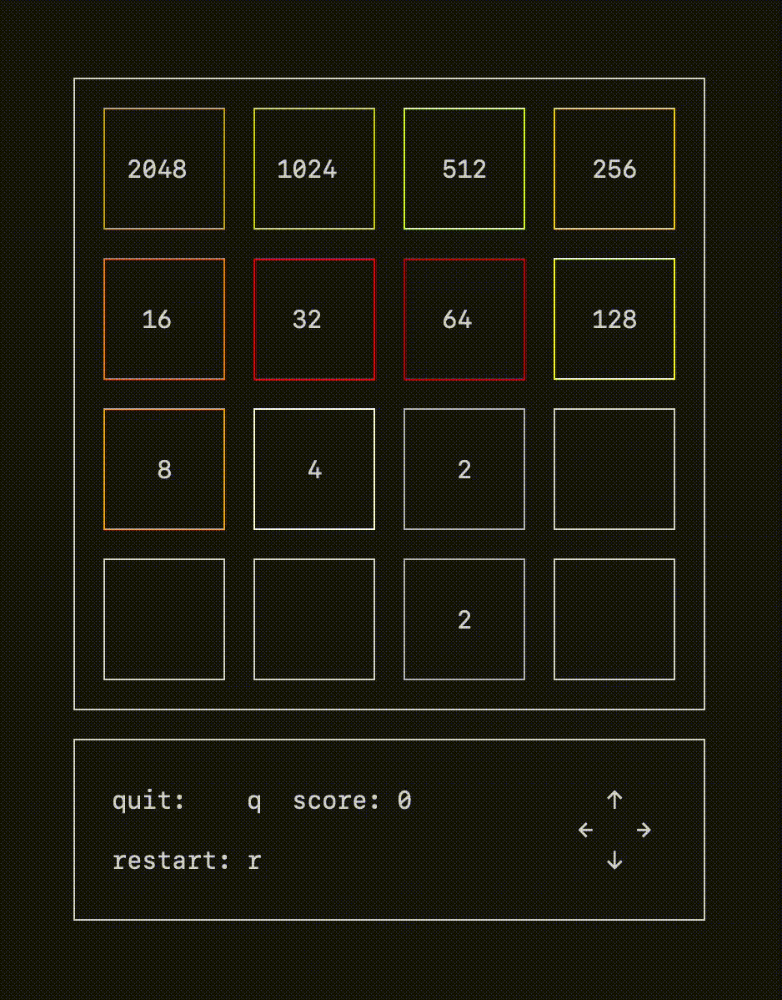

# 2048

A terminal-based version of 2048 written in C.




## Playing the game

Download from releases or build yourself (ncurses must be installed on your system to build)

```bash
make
```

Run the game:

```bash
./2048
```

Use arrow keys to move tiles:
- ← → ↑ ↓ to move
- Press `q` to quit
- Press `r` to restart

## Notes
This uses ncurses for the terminal interface, so it should work on most Unix-like systems (macOS, Linux, etc.).
